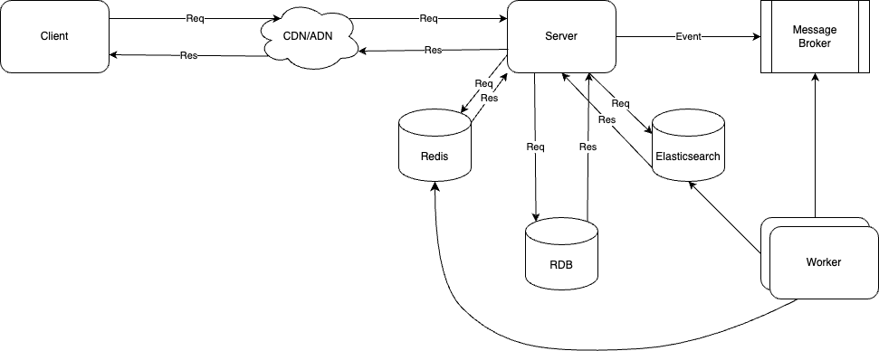

# 무신사 코딩 과제

## 프로젝트 개요
이 프로젝트는 무신사 코딩 과제로, 상품과 브랜드를 관리하는 시스템입니다. Spring Boot와 Kotlin을 사용하여 개발되었습니다.

## 기술 스택
- Kotlin
- Spring Boot
- JPA (Hibernate)
- Gradle
- H2 Database (테스트용)

## 아키텍처
- 실제로 서비스를 할 경우 현재 구현한 프로젝트로는 한계가 있음을 인지하고 있습니다.
- 전체적인 구현은 하지 못하였으며 처음 생각한 아키텍처는 다음과 같습니다.


### 설명
- **Client**: 사용자가 상품을 조회, 생성, 수정, 삭제할 수 있는 클라이언트
- **CDN/ADN**:
  - CDN: 정적 콘텐츠(이미지, JS, CSS)를 엣지 서버에 캐싱해 빠른 응답을 제공, 서버 부하를 완화.
  - ADN: 동적 트래픽(API 요청)에 대해 로드 밸런싱, WAF, SSL 처리, 트래픽 최적화 등을 수행해 안정성과 성능을 높임.
- **Server**: 메인 애플리케이션 서버로, 클라이언트에서 들어오는 상품 조회/생성/수정/삭제 등의 동적 요청을 처리하고, RDB‧Redis‧메시지 브로커 등과 연동하며 비즈니스 로직을 수행
- **Redis**: 캐싱 서버로, 상품 정보를 메모리에 저장하여 조회 성능을 높이고 DB 부하를 줄임.
- **RDB**: 관계형 데이터베이스로, 상품/브랜드 등의 영구 저장을 담당
- **Message Broker**: 생성/수정/삭제 요청에 대한 이벤트를 발행·구독하는 브로커(Kafka, RabbitMQ 등)를 통해 비동기 처리를 가능하게 함.
- **Worker**: 메시지 브로커로부터 이벤트를 수신, 데이터 가공 후 ElasticSearch에 인덱싱하거나, Redis 캐시 무효화 등 후속 작업을 처리.
- **ElasticSearch**: 로그/데이터 분석 및 검색 엔진으로, Worker를 통해 수집/가공된된 데이터(예: 상품 변경 이력, 로그)를 색인하고 빠른 검색을 지원.

### 고려한 사항
- 수십만 건 이상의 상품 정보를 실시간으로 조회하는 것은 성능에 부담이 될 수 있습니다.
- 따라서 상품 정보를 캐싱하여 빠르게 조회할 수 있는 구조를 생각했습니다.

## 프로젝트 구조
- `entity`: 데이터베이스 엔티티 클래스
- `repository`: 데이터베이스 접근을 위한 리포지토리 인터페이스
- `service`: 비즈니스 로직을 처리하는 서비스 클래스
- `vo`: 값 객체 (Value Object) 클래스
- `presentation`: HTTP 요청을 처리하는 컨트롤러 클래스
- `dto`: 데이터 전송 객체
- `exception`: 커스텀 예외 클래스

## 주요 기능
1. **상품 생성**: 새로운 상품을 생성합니다.
2. **상품 조회**: 상품을 조회합니다.
3. **상품 수정**: 기존 상품의 정보를 수정합니다.
4. **상품 삭제**: 특정 상품을 삭제합니다.
5. **카테고리별 최저가 상품 조회**: 각 카테고리별 최저가 상품을 조회합니다.
6. **단일 브랜드 최저가 상품 조회**: 단일 브랜드로 모든 카고리 상품을 최저가로 구매할 수 있는 정보를 조회합니다.
7. **카테고리별 최저가 및 최고가 상품 조회**: 각 카테고리별 최저가 및 최고가 상품을 조회합니다.

## 설정 및 실행 방법
1. **프로젝트 클론**
    ```bash
    git clone https://github.com/jooini/musinsa-coding-assignment.git
    cd musinsa-coding-assignment
    ```

2. **Gradle 빌드**
    ```bash
    ./gradlew build
    ```

3. **애플리케이션 실행**
    ```bash
    ./gradlew bootRun
    ```

4. **테스트 실행**
    ```bash
    ./gradlew test
    ```

## API 문서

### 상품 API

#### 1. 상품 생성
- **URL**: `/products`
- **Method**: `POST`
- **Request Body**:
  ```json
  {
    "brandId": 1,
    "categoryId": 1,
    "price": 1000
  }
  ```
- **Response**:
    - **Status Code**: `201 Created`
    - **Response Body**:
        ```json
            {
                "id": 10
            }
        ```
#### 2. 상품 조회
- **URL**: `/products`
- **Method**: `GET`
- **Response**:
    - **Status Code**: `200 Ok`
    - **Response Body**:
        ```json
            {
                  "products": [
                    {
                      "id": 1,
                      "brandId": 1,
                      "brandName": "A",
                      "categoryId": 1,
                      "categoryName": "상의",
                      "price": 11200
                    },
                    {
                      "id": 2,
                      "brandId": 1,
                      "brandName": "A",
                      "categoryId": 2,
                      "categoryName": "아우터",
                      "price": 5500
                    },
                ]
            }
        ```
#### 3. 상품 수정
- **URL**: `/products/{id}`
- **Method**: `PATCH`
- **PathVariable**:
    ```json
    "id": 1
    ```
- **Request Body**:
  ```json
  {
    "name": "test1",
  }
- **Response**:
    - **Status Code**: `200 Ok`
    - **Response Body**:
        ```json
            {
              "id": 2,
              "name": "test1"
            }
        ```
#### 4. 상품 삭제
- **URL**: `/products/{id}`
- **Method**: `DELETE`
- **Request Body**:
    - **PathVariable**
        ```json
        "id": 1
        ```
- **Response**:
    - **Status Code**: `204 No Content`
    - **Response Body**: `null`

#### 5. 카테고리별 최저가 상품 조회
- **URL**: `/products/lowest-by-category`
- **Method**: `GET`
- **Response**:
    - **Status Code**: `200 Ok`
    - **Response Body**:
        ```json
            {
              "products": [
                {
                  "categoryName": "상의",
                  "brandName": "C",
                  "price": 10000
                },
                {
                  "categoryName": "아우터",
                  "brandName": "E",
                  "price": 5000
                },
                {
                  "categoryName": "바지",
                  "brandName": "D",
                  "price": 3000
                },
                {
                  "categoryName": "스니커즈",
                  "brandName": "A",
                  "price": 9000
                },
                {
                  "categoryName": "가방",
                  "brandName": "A",
                  "price": 2000
                },
                {
                  "categoryName": "모자",
                  "brandName": "D",
                  "price": 1500
                },
                {
                  "categoryName": "양말",
                  "brandName": "I",
                  "price": 1700
                },
                {
                  "categoryName": "액세서리",
                  "brandName": "F",
                  "price": 1900
                }
              ],
              "totalPrice": 34100
            }
        ```
#### 6. 단일 브랜드 최저가 상품 조회
- **URL**: `/products/lowest-single-brand`
- **Method**: `GET`
- **Response**:
    - **Status Code**: `200 Ok`
    - **Response Body**:
        ```json
            {
              "brandName": "A",
              "products": [
                {
                  "categoryName": "상의",
                  "price": 10000
                },
                {
                  "categoryName": "아우터",
                  "price": 5000
                },
                {
                  "categoryName": "스니커즈",
                  "price": 9000
                },
                {
                  "categoryName": "가방",
                  "price": 2000
                }
              ],
              "totalPrice": 26000
            }
        ```
#### 7. 카테고리별 최저가 및 최고가 상품 조회
- **URL**: `/products/lowest-highest-by-category`
- **Method**: `GET`
- **Response**:
    - **Status Code**: `200 Ok`
    - **Response Body**:
        ```json
            {
              "category": "상의",
              "minPrice": [
                {
                  "brand": "C",
                  "price": 10000
                }
              ],
              "maxPrice": [
                {
                  "brand": "I",
                  "price": 11400
                }
              ]
            }
        ```
